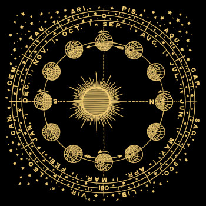
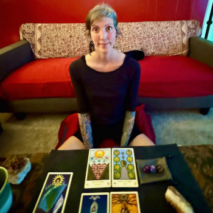
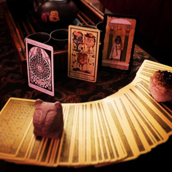
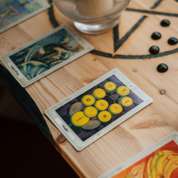

---
# Feel free to add content and custom Front Matter to this file.
# To modify the layout, see https://jekyllrb.com/docs/themes/#overriding-theme-defaults

title: Sacred Tarot & Astrology Consultation
layout: home
description: "Esme Midnight Katzen, professional tarot reader in Portland, Oregon. Lover of hermetic arts, magic and astrology By the grace of the ancestors, there go I."
---
<section id="home-intro-section" class="wrapper" markdown=1>

{: #home-profile-pic}

## My name is Esme Midnight Katzen
I am a professional tarot reader &amp; magical counselor located in the beautiful Pacific Northwest. I currently reside in Southeast Portland, Oregon. Lover of hermetic arts, magic and astrology By the grace of the ancestors, there go I.

***I have over 25 years of experience with tarot, esoteric systems of magic, psychic channeling.*** These can be done long distance through video apps or ***in my temple here in SE Portland, OR***. My sessions are a space and time out of the ordinary for you and I to call to our guides and ancestors to come work with us with the system of tarot and astrology, witchcraft and magic as a divinatory tool.

My sessions take 1-2 hours and the conversation is private and safe between us. We can cover any topic and formulate the best ways to ask the questions and see what signs and stories come up as solutions. I offer many different practical and magical solutions along the way for you to make real changes in your life.

## Questions About Tarot or Astrology Readings?
You can reach me via [email](mailto:esme.midnight.tarot@gmail.com){:target="_blank"}{:rel="noopener noreferrer"} or by using the [contact form below](#contact-form).

</section>

<section id="home-offerings-section">
  <h2 class="wrapper">Offerings - Tarot & Astrology</h2>
  

  

    
    

    <h3>Astrology Counsel</h3>
    Based on a western Hellenistic tradition. Natal chart readings, progressions, progressed moon phase interpretations, transit readings, & more. At my temple / home in SE Portland or via video call. Sessions last 1-2 hours.
    

  

  

    
    

    <h3>Private Parties  or Events</h3>
    Paid for by the host, several attendees receive an individual session of tarot or astrology consultation during a 3-4 hour party or event period.
    

  

  

    
    

    <h3>Deep Wisdom Tarot Sessions</h3>
    Tarot reading offered at my temple / home in SE Portland or via video call. These are conversations and divination with The Tarot. Sessions last 1-2 hours.
    

  

  

    
    

    <h3>Short Inquiries</h3>
    These solutions involve a brief session where we take your inquiry and consult
    3-5 cards. They last 30-45 minutes.
    

  

</section>
